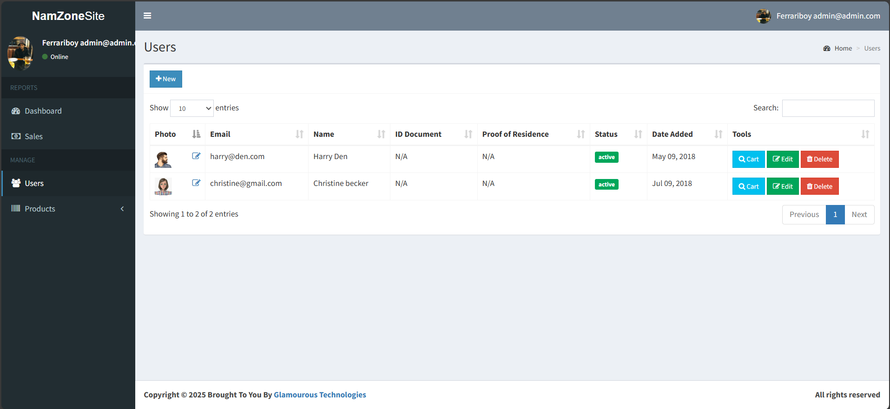
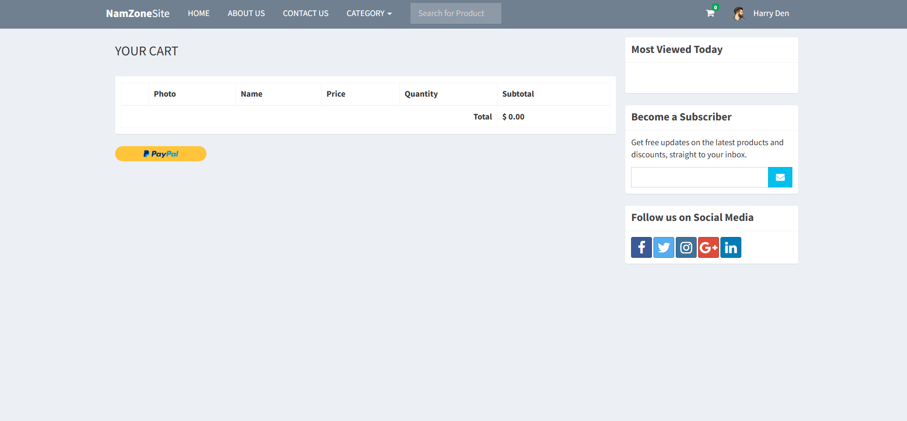

# NamZone

**NamZone** is a proudly Namibian platform dedicated to connecting sellers of quality second-hand goods with interested buyers across the country. Founded on the belief that everyone deserves affordable access to useful items, NamZone simplifies the process of buying and selling pre-owned products in a safe, transparent, and community-driven environment.

## Table of Contents

- [Features](#features)
- [Screenshots](#screenshots)
- [Built With](#built-with)
- [How to Run the App on a Dev Server](#how-to-run-the-app-on-a-dev-server)
- [Contact](#contact)

---

## Features

- Secure seller and buyer registration
- Listing and verification system for items
- Admin dashboard for managing users and listings
- Responsive design for mobile and desktop
- Secure file upload for proof of identity, residence, and payments

---

## Screenshots

---

### Home Page  
  
*Landing page showcasing featured items and search options*

### About Us  
  
*Information page detailing NamZone's mission and services*

### Admin Panel – User Management  
  
*Admin dashboard for managing user accounts and document verification*

### User Profile  
  
*User profile displaying personal information and uploaded documents*

### Cart  
  
*Shopping cart view showing selected second-hand items for purchase*

### Contact Us  
  
*Contact form for users to reach out to NamZone support*

### Document Upload  
  
*Upload interface for users to submit proof of residence and ID*

---

## Built With

- **[PHP](https://www.php.net/):** Backend logic and server-side scripting
- **[Bootstrap](https://getbootstrap.com/):** Frontend CSS framework for responsive UI
- **[MySQL](https://www.mysql.com/):** Database system for storing user data and item listings
- **[HTML](https://developer.mozilla.org/en-US/docs/Web/HTML):** Markup structure for the web pages
- **[CSS](https://developer.mozilla.org/en-US/docs/Web/CSS):** Styling and layout
- **[JavaScript](https://developer.mozilla.org/en-US/docs/Web/JavaScript):** Interactivity and client-side functionality

---

## How to Run the App on a Dev Server

1. Clone this repository to your local machine
2. Make sure you have Apache, PHP, and MySQL (e.g., XAMPP, LAMP, or MAMP stack) installed
3. Place the project folder in your web server's root directory (e.g., `htdocs` for XAMPP)
4. Import the provided SQL file into your MySQL database using phpMyAdmin or the MySQL CLI
5. Start Apache and MySQL services
6. Open your browser and go to `http://localhost/NamZone`

---

## Contact

For any inquiries or support, please contact:  
📧 **festushelaoshatipamba@gmail.com**

---

# Mini Project

This project was developed as part of the Network Security mini project to digitalise NamZone’s operations.
